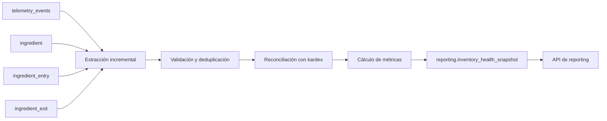
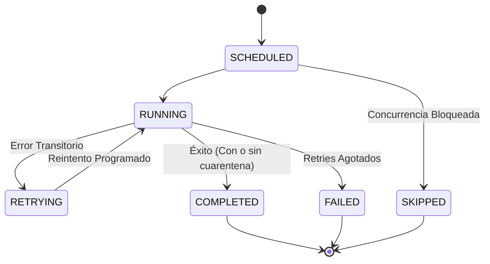

# Documento de Diseño: Inventory Health Business Pipeline
## Pipeline de Desempeño de Negocio — Parte 1 de 3: Diseño Arquitectónico y Operativo

---

## 1. Resumen Ejecutivo

Brasaland es una cadena de restaurantes de comida a la brasa fundada en 2008 en Medellín, Colombia. Actualmente opera 14 locales propios distribuidos en dos mercados internacionales: **Colombia** (6 locales operando en pesos colombianos, COP) y **Estados Unidos - Florida** (8 locales operando en dólares estadounidenses, USD), con una facturación anual de aproximadamente \$6 millones de dólares y una plantilla de ~115 colaboradores.

Históricamente, la operación de inventario de las sedes se ha gestionado de forma fragmentada mediante mensajes de WhatsApp y llamadas telefónicas directas a proveedores, sin visibilidad centralizada ni consolidación de existencias. Esta falta de información en tiempo real ocasiona sobrestock y mermas en algunos puntos mientras otros sufren quiebres de inventario (*stockouts*) en ingredientes críticos durante los turnos pico de servicio (e.g. 7:00 PM).

El **Inventory Health Business Pipeline** es el pipeline de datos diseñado para transformar la telemetría operacional y el registro transaccional (*kardex*) en un snapshot analítico de salud de inventario por local e ingrediente. Este pipeline permite a la Dirección de Operaciones y a los supervisores de sede tomar decisiones proactivas de reabastecimiento urgente y traslados de insumos antes de que ocurran quiebres en cocina.

### Alcance Estricto de la Fase (Parte 1 de 3)
Este documento constituye exclusivamente la **Parte 1 de 3 (Diseño Documental)**. En estricto cumplimiento del alcance:
- No se implementa código ejecutable del pipeline.
- No se crean tablas ni migraciones DDL en PostgreSQL.
- No se crean endpoints HTTP ni se modifican los existentes (`POST /telemetry/events`, `GET /telemetry/report`).
- No se instala Prefect ni se agregan dependencias o archivos de configuración al monorepo (`pyproject.toml`, `package.json`).
- No se introducen credenciales ni secretos.
- No se modifica `services/api/app/domains/telemetry/analysis.py` ni el dashboard técnico de telemetría (`/backoffice/telemetry`).
- No se construye todavía el dashboard de negocio (reservado para la Parte 3).

### Fuentes de Verdad y Equivalencia Canónica
- `docs/CONTEXT-brasaland.es.md`: **Contexto operativo canónico en español**. Establece la identidad de Brasaland como cadena de 14 sedes entre Colombia y Florida (EE. UU.), la dirección de Nicolás Park (CTO) y Felipe Guerrero (Director de Operaciones), y los antecedentes de incidentes operativos de abastecimiento de stock (`SUPPLY`), sirviendo como referencia principal en español del repositorio.
- `CONTEXT.md`: **Fuente corporativa canónica global**. Se documenta la equivalencia canónica: cualquier referencia en consignas o rúbricas a `CONTEXT-company.md` o `CONTEXT-empresa.md` se contrasta y valida directamente contra `docs/CONTEXT-brasaland.es.md` y `CONTEXT.md`, únicos documentos canónicos existentes en el repositorio. No se crean archivos ficticios.
- `company-choice.md`: Justificación del reto prioritario "Sistema inteligente de pedidos de ingredientes".
- `docs/telemetry/telemetry-plan.md` y `docs/telemetry/event-schemas.json`: Taxonomía y contratos JSON Schema Draft 2020-12 de los eventos de telemetría.
- `src/types/models.ts`: Modelo de dominio TypeScript (Hito 2).
- `services/api/app/domains/operations/inventory/models.py`: Modelo relacional SQLModel/PostgreSQL de inventario transaccional (`Ingredient`, `IngredientEntry`, `IngredientExit`).
- `services/api/app/domains/telemetry/models.py`, `schemas.py`, `analysis.py`, `service.py`: Modelo y contratos del almacén de eventos `telemetry_events` y del reporte técnico.
- PR #20 (`feat/telemetry-technical-report`): Base directa de trabajo sobre la cual se proyecta esta arquitectura analítica.

---

## 2. Estado Actual (Current State) y Brecha de Negocio

El repositorio cuenta actualmente con una infraestructura de telemetría técnica operativa establecida a través de las PRs #17, #18, #19 y #20:

### 2.1 Qué Responde el Reporte de Telemetría Existente
1. **Recepción e Ingesta:** Los eventos se reciben mediante peticiones `POST /telemetry/events` en FastAPI (`services/api/app/domains/telemetry/router.py`), validados individualmente bajo el envelope canónico SemVer 1.0.0 (`TelemetryEnvelopeBase`).
2. **Almacenamiento Append-Only:** Los eventos válidos se insertan de forma inmutable e idempotente en PostgreSQL en la tabla `telemetry_events` (exactamente 8 columnas: `event_id`, `event_type`, `timestamp`, `service`, `session_id`, `user_id`, `request_id`, `tags` en formato JSONB con índice GIN).
3. **Reporte Técnico Existente (`GET /telemetry/report`):** El endpoint técnico responde a preguntas de salud de infraestructura y comportamiento del sistema:
   - **Volumen diario de eventos:** `events_per_day` (agrupado por fecha UTC).
   - **Tipos de error técnico:** `error_rate_by_type` (frecuencia y proporción de `form_validation_failed`, `system_exception_captured`, `external_integration_failed`).
   - **Fallos de autenticación:** `login_failure_rate_per_day` (tasa diaria de fallos de acceso basada en `user_login_failed` vs `user_logged_in`).
   - **Latencia de API por ruta:** `api_latency_by_route` (conteo, latencia promedio y percentil 95 por ruta de backend).
   - Este reporte se procesa en memoria mediante Pandas (`services/api/app/domains/telemetry/analysis.py`), se optimiza con un caché de 60 segundos (`cache.py`) y se visualiza en el Backoffice en `/backoffice/telemetry`.

### 2.2 Brecha de Negocio (Qué NO Responde el Reporte de Telemetría)
El reporte técnico es agnóstico a la semántica del negocio de restaurantes. Por diseño, **no puede ni debe responder**:
- ¿Qué ingredientes específicos se encuentran agotados (*stockout*) en cada local?
- ¿Qué locales están operando con niveles de inventario por debajo del mínimo de seguridad?
- ¿Cuánto inventario neto ingresó o se consumió en un turno operativo?
- ¿En qué sedes se requieren transferencias de emergencia o colocación urgente de órdenes de compra?
- ¿En qué locales se intenta registrar consumo de ingredientes que el sistema marca con saldo cero?

### 2.3 Aislamiento e Independencia Arquitectónica
El **Inventory Health Business Pipeline** es un pipeline complementario y desacoplado. Sus resultados residen bajo el esquema analítico `reporting` y sus consultas serán expuestas mediante rutas independientes de negocio (`/reporting/*`). **No modifica el cálculo, el contrato, el caché ni la ruta del reporte técnico (`GET /telemetry/report`), ni escribe los resultados en `telemetry_events`.**

---

## 3. Propósito del Pipeline

> **Propósito en una sola frase:**
> El pipeline produce un snapshot actualizado de salud de inventario por local e ingrediente a partir de movimientos telemétricos y del kardex transaccional, para calcular el ratio de stock de seguridad (`METRIC_STOCK_LEVEL_RATIO`) y alertar quiebres de inventario de ingredientes críticos (`METRIC_CRITICAL_STOCKOUTS_COUNT`), permitiendo a Operaciones priorizar reabastecimientos y transferencias antes del turno pico.

### Objetivos Clave
- **Visibilidad proactiva:** Entregar a los tomadores de decisiones un estado de existencias consolidado cada 15 minutos, con una frescura máxima de 20 minutos.
- **Doble validación (Kardex + Telemetría):** Utilizar la telemetría operacional para detectar sedes e insumos con actividad reciente y comportamientos anómalos (intentos de salida sin saldo), y el kardex transaccional como fuente autoritativa de cálculo matemático.
- **Preparación ante el turno pico:** Detectar déficits antes de las 19:00 horas, permitiendo rebalanceos y aprovisionamiento oportuno.

---

## 4. Audiencia y Decisiones Habilitadas

### 4.1 Audiencia Principal y Consumidores
1. **Felipe Guerrero (Director de Operaciones):**
   - Requiere supervisión centralizada multi-sede (Medellín, Bogotá, Miami) para garantizar que ningún restaurante detenga su operación por desabastecimiento de insumos clave (e.g. carne para hamburguesas, cortes de res, salsas base).
2. **Supervisores de Locales:**
   - Requieren el semáforo de inventario local en tiempo real para organizar la recepción de pedidos, planificar la preparación en cocina y advertir al personal de sala sobre platillos en riesgo de agotamiento.
3. **Lucía Fernández (Gerente de Compras y Proveedores — Consumidor Secundario):**
   - Requiere visibilidad consolidada de déficits de stock para consolidar compras por volumen ante los ~20 proveedores de Colombia y Estados Unidos, mitigando compras de emergencia a precios desfavorables.

### 4.2 Decisiones Habilitadas
- **Identificar ingredientes agotados o bajo mínimo:** Priorizar alertas operativas antes del inicio del turno de almuerzo (11:30 AM) y turno de cena (7:00 PM).
- **Priorizar órdenes de compra urgentes:** Determinar qué pedidos de reposición no pueden esperar al ciclo semanal estándar y deben expedirse de inmediato.
- **Transferir inventario entre locales:** En conglomerados geográficos (e.g. sedes en Medellín o sedes en el sur de Florida), coordinar transferencias físicas de un local con sobrestock a uno en nivel crítico.
- **Investigar intentos recurrentes de salida sin stock:** Auditar discrepancias cuando cocina intenta registrar consumos en el sistema pero este es rechazado por falta de saldo disponible (`outbound_insufficient_stock_attempted`).
- **Verificar desalineación entre inventario físico y teórico:** Contrastar el stock resultante informado en telemetría con el balance estricto del kardex relacional.

---

## 5. Fuentes y Contratos de Extracción

El pipeline combina dos fuentes de datos persistidas en PostgreSQL: el almacén de telemetría (`telemetry_events`) y las tablas del kardex transaccional (`ingredient`, `ingredient_entry`, `ingredient_exit`).

```
┌────────────────────────────────────────────────────────┐
│                   FUENTES DE DATOS                     │
├────────────────────────────┬───────────────────────────┤
│ Telemetría Operacional     │ Kardex Transaccional      │
│ (telemetry_events)         │ (PostgreSQL OLTP)         │
│ - Detección de particiones │ - ingredient              │
│ - Intentos de sobregiro    │ - ingredient_entry        │
│ - Trazabilidad y linaje    │ - ingredient_exit         │
│                            │ - Saldo neto autoritativo │
└────────────────────────────┴───────────────────────────┘
```

### 5.1 Fuente Telemétrica: `telemetry_events`
- **Tabla:** `telemetry_events`
- **Columnas Requeridas:** `event_id`, `timestamp`, `event_type`, `tags`.
- **Eventos Relevantes del Dominio de Inventario:**
  1. `inbound_order_created`: Registro de entrada de inventario a local.
  2. `outbound_order_created`: Registro de salida/consumo de inventario en cocina.
  3. `stock_threshold_triggered`: Alerta emitida por cruce de umbral mínimo de seguridad.
  4. `outbound_insufficient_stock_attempted`: Intento interceptado de registrar una salida mayor al stock disponible.

#### Contrato por `event_type` (Propiedades dentro del campo `tags` JSONB)
No todas las propiedades aparecen en todos los eventos. La extracción respeta el contrato formal definido en `docs/telemetry/event-schemas.json` y `services/api/app/domains/telemetry/schemas.py`:

| Propiedad en `tags` | Tipo | `inbound_order_created` | `outbound_order_created` | `stock_threshold_triggered` | `outbound_insufficient_stock_attempted` |
| :--- | :--- | :---: | :---: | :---: | :---: |
| `order_id` | UUID (string) | **Requerido** | **Requerido** | *No aplica* | *No aplica* |
| `local_id` | string (min 1) | **Requerido** | **Requerido** | **Requerido** | **Requerido** |
| `ingredient_id` | UUID (string) | **Requerido** | **Requerido** | **Requerido** | **Requerido** |
| `ingredient_sku` | string (min 1) | **Requerido** | **Requerido** | **Requerido** | **Requerido** |
| `quantity` | number (> 0) | **Requerido** | **Requerido** | *No aplica* | *No aplica* |
| `requested_quantity`| number (> 0) | *No aplica* | *No aplica* | *No aplica* | **Requerido** |
| `previous_stock` | number | **Requerido** | **Requerido** | *No aplica* | *No aplica* |
| `resulting_stock` | number | **Requerido** | **Requerido** ($\ge 0$) | *No aplica* | *No aplica* |
| `current_stock` | number | *No aplica* | *No aplica* | **Requerido** | *No aplica* |
| `available_stock` | number | *No aplica* | *No aplica* | *No aplica* | **Requerido** |
| `minimum_stock` | number ($\ge 0$) | *No aplica* | *No aplica* | **Requerido** | *No aplica* |
| `deficit` | number ($\ge 0$) | *No aplica* | *No aplica* | **Requerido** | *No aplica* |
| `unit_of_measure` | string (min 1) | **Requerido** | **Requerido** | **Requerido** | **Requerido** |
| `severity` | string enum | *No aplica* | *No aplica* | **Requerido** (`critical_depletion`, `minimum_reached`) | *No aplica* |
| `rejection_source` | string enum | *No aplica* | *No aplica* | *No aplica* | **Requerido** (`client_form_guard`, `backend_transaction_lock`) |

### 5.2 Fuentes Transaccionales: Kardex Relacional
Definidas en `services/api/app/domains/operations/inventory/models.py`:
1. **`ingredient` (Catálogo maestro de ingredientes):**
   - `id`: UUID (Clave primaria).
   - `sku`: VARCHAR(50) (Código único, e.g. `ING-001`).
   - `name`: VARCHAR(150) (Nombre descriptivo).
   - `category`: VARCHAR(50) (`carne`, `verdura`, `salsa`, `bebida`, `empaque`, `limpieza`).
   - `unit_of_measure`: VARCHAR(30) (e.g. `kg`, `litros`, `unidades`).
   - `minimum_stock`: NUMERIC(10, 2) (Umbral de seguridad no negativo).
   - `perishable`: BOOLEAN (Indicador de perecibilidad).
2. **`ingredient_entry` (Movimientos de Entrada):**
   - `id`: UUID (Clave primaria).
   - `ingredient_id`: UUID (FK a `ingredient.id`).
   - `local_id`: VARCHAR(50) (Identificador de sede, e.g. `MED-001`, `MIA-001`).
   - `quantity`: NUMERIC(10, 2) (Cantidad ingresada, estrictamente $> 0$).
   - `created_at`: TIMESTAMPTZ (Marca temporal UTC de la transacción).
3. **`ingredient_exit` (Movimientos de Salida / Consumo):**
   - `id`: UUID (Clave primaria).
   - `ingredient_id`: UUID (FK a `ingredient.id`).
   - `local_id`: VARCHAR(50) (Identificador de sede).
   - `quantity`: NUMERIC(10, 2) (Cantidad consumida, estrictamente $> 0$).
   - `created_at`: TIMESTAMPTZ (Marca temporal UTC de la transacción).

### 5.3 Rol de Cada Fuente y Regla Autorizativa de Stock
- **Telemetría:** Permite identificar de manera incremental qué particiones `(local_id, ingredient_id)` tuvieron actividad, cuantificar intentos de salida denegados por sobregiro (`outbound_insufficient_stock_attempted`) y conservar trazabilidad y linaje de eventos.
- **Kardex Transaccional:** Es la **fuente autoritativa** de verdad para el cálculo de stock disponible.
- **Fórmula de Stock Autoritativo:**
  $$\text{current\_stock} = \sum(\text{ingredient\_entry.quantity}) - \sum(\text{ingredient\_exit.quantity})$$
- **Regla Crítica:** El pipeline **nunca** toma el `resulting_stock` de la telemetría como saldo final definitivo. Lo utiliza exclusivamente para auditar y reconciliar posibles discrepancias frente al kardex.

---

## 6. Métricas de Negocio y Fórmulas

Las métricas del pipeline responden exclusivamente a necesidades operativas y de aprovisionamiento de Brasaland:

### 6.1 `METRIC_STOCK_LEVEL_RATIO` (Ratio de Nivel de Stock)
- **Granularidad:** `snapshot_date` + `local_id` + `ingredient_id`.
- **Fórmula Matemática:**
  $$\text{stock\_level\_ratio} = \frac{\text{current\_stock}}{\text{minimum\_stock}}$$
- **Reglas Operativas:**
  - Si $\text{minimum\_stock} > 0$, calcular el cociente.
  - Si $\text{minimum\_stock} = 0$, asignar `null` y emitir una advertencia de calidad en la ejecución (evitando división por cero).
  - Conservar `current_stock`, `minimum_stock` y `unit_of_measure` en el registro para garantizar auditabilidad total.
- **Pregunta de Negocio:** ¿Qué tan cerca está cada ingrediente de agotar su stock de seguridad en cada local?
  - Un ratio $< 1.0$ indica nivel bajo mínimo.
  - Un ratio $\le 0.0$ indica quiebre absoluto (*stockout*).

### 6.2 `METRIC_CRITICAL_STOCKOUTS_COUNT` (Conteo de Ingredientes Agotados)
- **Granularidad:** `snapshot_date` + `local_id`.
- **Fórmula Matemática:**
  $$\text{critical\_stockouts\_count} = \text{COUNT}(\text{DISTINCT } \text{ingredient\_id WHERE } \text{current\_stock} \le 0)$$
- **Reglas Operativas:**
  - Aplica sobre todos los ingredientes activos asignados o movilizados en la sede.
- **Pregunta de Negocio:** ¿Cuántos ingredientes se encuentran completamente agotados en cada local?

### 6.3 `METRIC_BELOW_MINIMUM_COUNT` (Conteo de Ingredientes Bajo Mínimo)
- **Granularidad:** `snapshot_date` + `local_id`.
- **Fórmula Matemática:**
  $$\text{below\_minimum\_count} = \text{COUNT}(\text{DISTINCT } \text{ingredient\_id WHERE } \text{current\_stock} > 0 \text{ AND } \text{current\_stock} \le \text{minimum\_stock})$$
- **Reglas Operativas:**
  - Excluye los ingredientes que ya están en cero (agotados), clasificando exclusivamente aquellos en riesgo inminente de agotamiento.
- **Pregunta de Negocio:** ¿Cuántos ingredientes requieren reabastecimiento urgente antes de agotarse durante el turno?

### 6.4 `METRIC_INSUFFICIENT_STOCK_ATTEMPTS_COUNT` (Conteo de Intentos sin Stock)
- **Granularidad:** `snapshot_date` + `local_id` + `ingredient_id`.
- **Fórmula Matemática:**
  $$\text{insufficient\_stock\_attempts\_count} = \text{COUNT}(\text{event\_id}) \text{ WHERE } \text{event\_type} = \text{'outbound\_insufficient\_stock\_attempted'}$$
- **Reglas Operativas:**
  - Agrupa eventos interceptados tanto en la interfaz (`client_form_guard`) como en la API mediante bloqueo pesimista (`backend_transaction_lock`).
- **Pregunta de Negocio:** ¿En qué locales y con qué ingredientes el personal de cocina intenta registrar consumos que el sistema rechaza por falta de saldo teórico?

> **Exclusión Explícita:** Este pipeline no incluye métricas técnicas de infraestructura (latencia HTTP, percentiles P95, tasa de errores 500, o volumen de invocaciones), las cuales pertenecen exclusivamente a `GET /telemetry/report`.

---

## 7. Destino del Pipeline: Esquema `reporting`

Los resultados del pipeline se modelan para el motor relacional PostgreSQL bajo un esquema analítico dedicado denominado `reporting`.

### 7.1 Tabla Principal: `reporting.inventory_health_snapshot`
- **Grano:** Exactamente **una fila** por combinación de:
  $$\text{snapshot\_date} + \text{local\_id} + \text{ingredient\_id}$$
- **Clave de Idempotencia y Llave Primaria:**
  $$\text{PRIMARY KEY } (\text{snapshot\_date}, \text{local\_id}, \text{ingredient\_id})$$

#### Definición de Columnas Mínimas Requeridas
| Columna | Tipo de Dato | Nulo | Descripción |
| :--- | :--- | :---: | :--- |
| `snapshot_date` | `DATE` | No | Fecha del snapshot en UTC (`YYYY-MM-DD`). Parte de la PK. |
| `local_id` | `VARCHAR(50)` | No | Identificador de sede (e.g. `MED-001`, `MIA-001`). Parte de la PK. |
| `ingredient_id` | `UUID` | No | Identificador UUID del ingrediente. Parte de la PK. |
| `ingredient_sku` | `VARCHAR(50)` | No | SKU canónico del catálogo (e.g. `ING-001`). |
| `ingredient_name` | `VARCHAR(150)` | No | Nombre del ingrediente en catálogo. |
| `category` | `VARCHAR(50)` | No | Categoría (`carne`, `verdura`, `salsa`, `bebida`, `empaque`, `limpieza`). |
| `unit_of_measure` | `VARCHAR(30)` | No | Unidad de medida (e.g. `kg`, `litros`, `unidades`). |
| `current_stock` | `NUMERIC(10, 2)` | No | Stock disponible recalculado autoritativamente desde el kardex. |
| `minimum_stock` | `NUMERIC(10, 2)` | No | Umbral de stock mínimo de seguridad configurado. |
| `stock_level_ratio` | `NUMERIC(10, 4)` | Sí | Ratio $\frac{\text{current\_stock}}{\text{minimum\_stock}}$. Nulo si $\text{minimum\_stock} = 0$. |
| `stock_deficit` | `NUMERIC(10, 2)` | No | Déficit de reposición: $\max(\text{minimum\_stock} - \text{current\_stock}, 0)$. |
| `is_stockout` | `BOOLEAN` | No | `TRUE` si $\text{current\_stock} \le 0$; en caso contrario `FALSE`. |
| `is_below_minimum` | `BOOLEAN` | No | `TRUE` si $\text{current\_stock} > 0$ y $\text{current\_stock} \le \text{minimum\_stock}$; en caso contrario `FALSE`. |
| `inbound_quantity` | `NUMERIC(10, 2)` | No | Cantidad total acumulada ingresada en el día de snapshot. |
| `outbound_quantity`| `NUMERIC(10, 2)` | No | Cantidad total acumulada consumida en el día de snapshot. |
| `insufficient_stock_attempts_count` | `INTEGER` | No | Cantidad de intentos de salida denegados en el día de snapshot. |
| `source_event_count` | `INTEGER` | No | Total de eventos telemétricos procesados para esta fila. |
| `source_first_event_at` | `TIMESTAMPTZ` | Sí | Marca temporal UTC del primer evento del lote procesado. |
| `source_last_event_at` | `TIMESTAMPTZ` | Sí | Marca temporal UTC del último evento del lote procesado. |
| `pipeline_run_id` | `UUID` | No | Identificador de ejecución del pipeline (trazabilidad y linaje). |
| `computed_at` | `TIMESTAMPTZ` | No | Timestamp UTC de cálculo y carga de la fila en la tabla. |

### 7.2 Vista Agregada Propuesta: `reporting.inventory_health_daily`
Para simplificar consultas analíticas ejecutivas de la Dirección de Operaciones, se propone la vista lógica agregada (sin implementarla en esta fase):
- **Grano:** `snapshot_date` + `local_id`.
- **Campos Agregados:**
  - `snapshot_date`
  - `local_id`
  - `critical_stockouts_count` ($\sum \text{is\_stockout}$)
  - `below_minimum_count` ($\sum \text{is\_below\_minimum}$)
  - `average_stock_level_ratio` ($\text{AVG}(\text{stock\_level\_ratio})$)
  - `insufficient_stock_attempts_count` ($\sum \text{insufficient\_stock\_attempts\_count}$)
  - `total_active_ingredients` ($\text{COUNT}(\text{ingredient\_id})$)
  - `computed_at` ($\max(\text{computed\_at})$)

*(Nota: En cumplimiento estricto de la Parte 1 de 3, no se crean tablas ni vistas físicas en la base de datos).*

---

## 8. Arquitectura y Flujo de Datos

### 8.1 Diagrama Mermaid de Arquitectura
El siguiente diagrama describe el flujo de extremo a extremo, desde las fuentes operativas hasta la publicación y consulta analítica:



### 8.2 Descripción Detallada por Etapa
1. **Extracción Incremental:**
   - La tarea lee eventos de `telemetry_events` a partir de un watermark persistente `(watermark_timestamp, watermark_event_id)` y reabre una ventana móvil de 48 horas hacia atrás.
   - Extrae paralelamente las entidades maestras de `ingredient` y los movimientos transaccionales de `ingredient_entry` e `ingredient_exit` pertenecientes a las particiones `(local_id, ingredient_id)` detectadas con actividad.
2. **Validación y Deduplicación:**
   - Valida el contrato JSON de cada evento contra su esquema correspondiente.
   - Si un registro presenta anomalías irrecuperables (e.g. falta de `local_id`, cantidad no numérica), se desvía a `reporting.inventory_health_quarantine`.
   - Se deduplica en memoria por `event_id` como mecanismo de defensa en profundidad para descartar posibles duplicados concurrentes en el lote.
3. **Reconciliación con Kardex:**
   - Para cada partición afectada `(local_id, ingredient_id)`, se totalizan las entradas y salidas registradas en el kardex transaccional.
   - Se calcula el saldo disponible autoritativo: $\text{current\_stock} = \sum(\text{entries}) - \sum(\text{exits})$.
   - Se compara este valor con el `resulting_stock` del último evento telemétrico; si se detectan diferencias, se genera una señal de discrepancia operativa en la observabilidad sin interrumpir la carga.
4. **Transformación y Cálculo de Métricas:**
   - Se calcula `stock_deficit = MAX(minimum_stock - current_stock, 0)`.
   - Se evalúa `stock_level_ratio = current_stock / minimum_stock` (controlando división por cero).
   - Se asignan los flags booleanos `is_stockout` e `is_below_minimum`.
   - Se computan los agregados diarios de entradas, salidas e intentos fallidos de consumo.
5. **Carga Atómica e Idempotente:**
   - Se abre una transacción única en PostgreSQL (`BEGIN ... COMMIT`).
   - Se ejecuta un `INSERT ... ON CONFLICT (snapshot_date, local_id, ingredient_id) DO UPDATE` sobre `reporting.inventory_health_snapshot`.
   - Se registran las relaciones de linaje en `reporting.inventory_health_lineage`.
   - Se actualiza el watermark en `reporting.pipeline_checkpoints`.
6. **Publicación:**
   - El snapshot queda inmediatamente disponible para ser consumido por las vistas y endpoints analíticos.
7. **Observabilidad:**
   - Se emiten contadores de ejecución (`records_read`, `snapshots_updated`, `quarantine_count`, `watermark_lag_seconds`) y estados del flujo hacia el sistema de telemetría y logs estructurados.

---

## 9. Cadencia, Frescura y Ventanas de Procesamiento

El pipeline opera bajo una arquitectura híbrida de micro-batch programado con capacidad de ejecución manual y reconciliación nocturna:

```
┌────────────────────────────────────────────────────────┐
│               ESTRATEGIA DE EJECUCIÓN                  │
├──────────────────────────┬─────────────────────────────┤
│ Micro-batch cada 15 min  │ Reconciliación Nocturna     │
│ - Ventana móvil 48h      │ - Todas las combinaciones   │
│ - Solo particiones activas│ - Detección kardex sin tele │
│ - Frescura < 20 min      │ - Detección de tardíos > 48h│
└──────────────────────────┴─────────────────────────────┘
```

1. **Ejecución Programada cada 15 Minutos (`*/15 * * * *`):**
   - Procesa únicamente las particiones `(local_id, ingredient_id)` que hayan registrado eventos en la telemetría o movimientos en el kardex durante la ventana de corte.
   - **Frescura de Datos Garantizada:** Máximo **20 minutos** desde que ocurre una recepción de mercancía o salida de cocina hasta que el indicador impacta el snapshot.
2. **Ejecución Manual Autorizada:**
   - Habilitada bajo demanda para supervisores o directores de operaciones (e.g. antes de auditorías de inventario o inmediatamente tras una recepción masiva en bodega).
3. **Reconciliación Completa Nocturna (03:00 UTC / Horario de Cierre):**
   - Recalcula exhaustivamente todas las combinaciones activas de `(local_id, ingredient_id)` a través de los 14 locales, independientemente de si registraron eventos en el día.
   - Identifica desalineaciones estructurales, tales como movimientos de kardex manuales realizados directamente en base de datos sin emisión de telemetría.

---

## 10. Idempotencia y Manejo de Concurrencia

Para garantizar la integridad matemática del snapshot analítico ante reintentos de red, caídas de infraestructura o reprocesamientos manuales, el pipeline implementa garantías de idempotencia en cada capa:

### 10.1 Duplicados en Telemetría
- **Capa de Almacenamiento:** La tabla `telemetry_events` ya cuenta con `event_id` como clave primaria y la ingesta utiliza `ON CONFLICT (event_id) DO NOTHING`.
- **Capa del Pipeline:** La tarea de validación vuelve a deduplicar por `event_id` en memoria para asegurar que un lote no procese dos veces el mismo identificador.
- **Capa de Destino:** La tabla `reporting.inventory_health_snapshot` utiliza la clave compuesta:
  $$\text{PRIMARY KEY } (\text{snapshot\_date}, \text{local\_id}, \text{ingredient\_id})$$
- La carga se realiza mediante un `UPSERT` determinista:
  ```sql
  INSERT INTO reporting.inventory_health_snapshot (
      snapshot_date, local_id, ingredient_id, ...
  ) VALUES (...)
  ON CONFLICT (snapshot_date, local_id, ingredient_id)
  DO UPDATE SET
      current_stock = EXCLUDED.current_stock,
      minimum_stock = EXCLUDED.minimum_stock,
      stock_level_ratio = EXCLUDED.stock_level_ratio,
      stock_deficit = EXCLUDED.stock_deficit,
      is_stockout = EXCLUDED.is_stockout,
      is_below_minimum = EXCLUDED.is_below_minimum,
      inbound_quantity = EXCLUDED.inbound_quantity,
      outbound_quantity = EXCLUDED.outbound_quantity,
      insufficient_stock_attempts_count = EXCLUDED.insufficient_stock_attempts_count,
      source_event_count = EXCLUDED.source_event_count,
      source_last_event_at = EXCLUDED.source_last_event_at,
      pipeline_run_id = EXCLUDED.pipeline_run_id,
      computed_at = EXCLUDED.computed_at;
  ```
- **Determinismo:** Reprocesar la misma ventana temporal produce exactamente el mismo resultado en la base de datos sin duplicar filas ni alterar acumuladores de forma aditiva no controlada.

### 10.2 Reintento tras Carga Parcial y Comportamiento en la Segunda Corrida
La estrategia de idempotencia es explícita respecto a lo que sucede si ocurre un fallo en la fase de carga:

1. **Fallo en la Primera Corrida (Fase de Carga):**
   - Las escrituras en `reporting.inventory_health_snapshot`, `reporting.inventory_health_lineage` y la actualización del watermark en `reporting.pipeline_checkpoints` se ejecutan bajo una **única transacción atómica ACID** (`BEGIN ... COMMIT`).
   - Si la conexión se cae, se agota el timeout o el servidor aborta antes del `COMMIT`, el motor PostgreSQL ejecuta un `ROLLBACK` total.
   - Ninguna fila parcial ni corrupta persiste en `reporting.inventory_health_snapshot` ni en la tabla de linaje.
   - El watermark de extracción en `reporting.pipeline_checkpoints` **no avanza** y permanece anclado en el último estado exitoso conocido.

2. **Comportamiento Concreto en la Segunda Corrida (Reintento u Orquestación Siguiente):**
   - El extractor lee el checkpoint anterior inalterado y vuelve a extraer exactamente la misma ventana temporal de eventos y movimientos de kardex.
   - Las tareas de validación y cálculo recalculan deterministamente el estado autoritativo completo de las particiones afectadas.
   - Al llegar a la fase de carga, la instrucción SQL utiliza la cláusula `ON CONFLICT (snapshot_date, local_id, ingredient_id) DO UPDATE SET ...`:
     - Si alguna fila remanente existiera por un escenario anómalo previo, el `UPSERT` sobrescribe de forma determinista todos los campos con los nuevos valores calculados.
     - Si no existía, inserta limpiamente el registro.
   - Se inserta el linaje correspondiente y, solo tras completar exitosamente todas las operaciones del lote, la transacción ejecuta el `COMMIT` final y avanza el watermark.
   - **Resultado garantizado:** Cero duplicados, cero datos huérfanos y total paridad matemática entre corridas.

### 10.3 Reintentos desde el Cliente (`POST /telemetry/events`)
El servicio de frontend (`TelemetryService`) reintenta envíos fallidos con backoff exponencial y jitter conservando el mismo `eventId`. El backend almacena una sola vez el evento y el pipeline procesa exactamente un registro por acción operativa.

---

## 11. Estrategia de Checkpoint y Manejo de Eventos Tardíos

Dado que la tabla `telemetry_events` es append-only y **no cuenta con columna `ingested_at`**, el pipeline no altera el esquema de telemetría existente. En su lugar, gestiona un checkpoint persistente propio en el esquema `reporting`.

### 11.1 Tabla de Checkpoints: `reporting.pipeline_checkpoints`
- **Campos Mínimos:**
  - `pipeline_name`: VARCHAR(100) (PK, e.g. `'inventory_health_business'`).
  - `source_name`: VARCHAR(100) (PK, e.g. `'telemetry_events'`).
  - `watermark_timestamp`: TIMESTAMPTZ (Marca temporal UTC máxima procesada con éxito).
  - `watermark_event_id`: UUID (Desempate determinista para eventos con idéntico timestamp).
  - `last_successful_run_id`: UUID (Identificador de la última ejecución exitosa).
  - `updated_at`: TIMESTAMPTZ (Fecha de actualización del checkpoint).

### 11.2 Extracción y Ventana Móvil de 48 Horas (*Rolling Window*)
Para absorber desfasajes de red en locales o cierres de turno tardíos:
1. En cada corrida de 15 minutos, la consulta de extracción toma:
   $$\text{timestamp} \ge \max(\text{watermark\_timestamp} - \text{interval '48 hours'}, \text{inicio\_del\_dia\_utc})$$
2. Los eventos dentro de la ventana de 48 horas se deduplican contra los registros de linaje existentes (`reporting.inventory_health_lineage`).
3. Si arriba un evento con timestamp correspondiente a una fecha previa dentro de las 48 horas (evento tardío):
   - El pipeline identifica la fecha del evento y la partición `(local_id, ingredient_id)`.
   - **Regla estricta:** Un evento tardío provoca el **recálculo integral** del snapshot correspondiente a esa fecha y partición. Nunca se suma o incrementa un agregado publicado de forma ciega.
   - El `UPSERT` actualiza la fila histórica con los nuevos valores recalculados.
4. **Reconciliación Nocturna:** Busca eventos en `telemetry_events` que no posean entrada en `reporting.inventory_health_lineage`, descubriendo eventos tardíos que hayan llegado fuera de la ventana de 48 horas y disparando la remediación del día afectado.

---

## 12. Linaje de Datos y Auditoría

Para garantizar trazabilidad completa de cada cifra presentada a la dirección ejecutiva, se propone la tabla de linaje:

### 12.1 Tabla de Linaje: `reporting.inventory_health_lineage`
- **Campos:**
  - `pipeline_run_id`: UUID (Identificador único de la corrida del pipeline).
  - `event_id`: UUID (Identificador del evento telemétrico de origen).
  - `snapshot_date`: DATE (Fecha del snapshot afectado).
  - `local_id`: VARCHAR(50) (Sede afectada).
  - `ingredient_id`: UUID (Ingrediente afectado).
  - `processed_at`: TIMESTAMPTZ (Fecha de procesamiento).
- **Llave Primaria:** `PRIMARY KEY (pipeline_run_id, event_id)`

### 12.2 Trazabilidad de Extremo a Extremo
Permite reconstruir el camino inverso exacto:
$$\text{KPI en Dashboard} \longrightarrow \text{Snapshot Diario} \longrightarrow \text{Pipeline Run ID} \longrightarrow \text{Event IDs en Linaje} \longrightarrow \text{telemetry\_events}$$

### 12.3 Protocolo de Investigación de Anomalías Operativas
- **Huecos de eventos (*event gaps*):** Consultar lapsos prolongados en `telemetry_events` sin registros para un `local_id` en horario operativo (11:00 - 23:00) y cruzar contra `pos_heartbeat_recorded`.
- **Ráfagas inesperadas (*bursts*):** Agrupar `COUNT(event_id)` por intervalos de 1 minuto para detectar reintentos masivos de scripts o dobles lecturas de código de barras.
- **Duplicados:** Identificar intentos de inserción con `event_id` repetido en logs de ingesta.
- **Desfases temporales:** Calcular $\Delta t = \text{computed\_at} - \text{timestamp}$ para medir retrasos de sincronización entre sedes remotas y el servidor central.
- **Kardex sin telemetría:** Consultar filas en `ingredient_entry` o `ingredient_exit` cuyo `id` no esté presente en `telemetry_events.tags->>'order_id'`. Permite descubrir inserciones directas por base de datos que eluden los canales oficiales.
- **Telemetría sin kardex:** Consultar eventos `inbound_order_created` o `outbound_order_created` cuyos `order_id` no existan en las tablas relacionales, revelando rollbacks transaccionales en el backend donde el evento telemétrico fue emitido prematuramente.
- **Gobernanza Zero-PII:** En estricto apego al estándar de seguridad corporativo, la tabla de linaje y el esquema `reporting` no copian contraseñas, hashes, correos electrónicos, nombres personales, tokens JWT ni cookies de sesión.

---

## 13. Calidad de Datos y Cuarentena

Los errores en los datos nunca deben detener la ejecución de todo el lote ni contaminar los snapshots de salud de inventario.

### 13.1 Tabla de Cuarentena: `reporting.inventory_health_quarantine`
- **Campos Mínimos:**
  - `quarantine_id`: UUID (PK, generado automáticamente).
  - `event_id`: UUID (Identificador del evento defectuoso).
  - `pipeline_run_id`: UUID (Corrida donde se interceptó).
  - `event_type`: VARCHAR(100) (Tipo de evento).
  - `reason_code`: VARCHAR(50) (Código tipificado del error).
  - `reason_detail`: TEXT (Descripción detallada de la anomalía).
  - `raw_payload`: JSONB (Copia íntegra del registro para auditoría y remediación).
  - `quarantined_at`: TIMESTAMPTZ (Timestamp UTC de desvío).

### 13.2 Casos de Cuarentena Tipificados
1. `MISSING_LOCAL_ID`: Evento sin propiedad `local_id` o con cadena vacía.
2. `MISSING_INGREDIENT_ID`: Evento sin identificador de ingrediente o UUID malformado.
3. `NON_NUMERIC_QUANTITY`: Cantidad no numérica o parseable (`NaN`, `null`, `string`).
4. `NEGATIVE_QUANTITY`: Cantidad menor o igual a cero en eventos que exigen valores estrictamente positivos (`inbound_order_created`, `outbound_order_created`).
5. `INCOMPATIBLE_STRUCTURE`: Falta de propiedades obligatorias según el contrato formal de `docs/telemetry/event-schemas.json`.
6. `UNKNOWN_INGREDIENT_ID`: El UUID del ingrediente no existe en la tabla maestra `ingredient`.
7. `INCOMPATIBLE_UNIT`: La unidad de medida en el evento no coincide con la unidad registrada en el catálogo oficial (`ingredient.unit_of_measure`).
8. `INVALID_TIMESTAMP`: Timestamp no parseable en ISO 8601 o fecha futura incoherente (> 10 minutos respecto a la hora del servidor).

### 13.3 Reglas Operativas de Calidad
- **Aislamiento del Error:** Un evento inválido se desvía a la tabla de cuarentena de forma inmediata; el resto de los eventos del lote continúa su procesamiento normal.
- **Fallas Transitorias vs Errores Deterministas:**
  - Las fallas transitorias de infraestructura (e.g. timeout de red en PostgreSQL) se reintentan mediante la política de retries.
  - Los errores deterministas de calidad en los datos se envían a cuarentena sin reintentos innecesarios.
- **Contabilización:** Los registros en cuarentena **no** se contabilizan como procesados con éxito. La corrida finaliza con una advertencia si la tasa de cuarentena es mayor a cero.

---

## 14. Observabilidad y Monitoreo del Pipeline

Cada ejecución del pipeline emite métricas estructuradas de observabilidad para evaluar el rendimiento y la frescura del sistema:

### 14.1 Métricas por Ejecución
- `pipeline_run_status`: Estado final (`SCHEDULED`, `RUNNING`, `COMPLETED`, `FAILED`, `RETRYING`, `SKIPPED`).
- `pipeline_duration_seconds`: Tiempo total de ejecución de la corrida.
- `source_events_read`: Cantidad de eventos leídos desde `telemetry_events`.
- `source_events_deduplicated`: Cantidad de eventos duplicados descartados en memoria.
- `inventory_partitions_recomputed`: Número de combinaciones `(local_id, ingredient_id)` recalculadas.
- `snapshots_inserted`: Nuevas filas creadas en `reporting.inventory_health_snapshot`.
- `snapshots_updated`: Filas actualizadas por cambios de stock o recálculo de eventos tardíos.
- `records_quarantined`: Cantidad de eventos desviados a cuarentena por errores de validación.
- `late_events_detected`: Cantidad de eventos tardíos detectados pertenecientes a ciclos previos.
- `ledger_without_telemetry_count`: Movimientos de kardex detectados sin correlación telemétrica.
- `telemetry_without_ledger_count`: Eventos telemétricos detectados sin contraparte en el kardex.
- `watermark_lag_seconds`: Diferencia en segundos entre la hora actual y el `watermark_timestamp`.

### 14.2 Estados Formales de Ejecución


### 14.3 Alertas Operativas Críticas
Se definen umbrales de alerta inmediata hacia canales de soporte y operaciones:
1. **Flujo Fallido:** El pipeline finaliza en `FAILED` tras agotar su política de reintentos.
2. **Checkpoint Estancado:** El watermark de extracción no avanza durante más de 30 minutos en horario de operación de restaurantes (11:00 a 23:00 local).
3. **Pico de Cuarentena:** Más del **1%** de los eventos de un lote son desviados a cuarentena.
4. **Degradación de Frescura:** `watermark_lag_seconds` supera los 20 minutos (1.200 segundos) durante el servicio.
5. **Discrepancia Estructural:** Detección de más de 5 movimientos en kardex sin telemetría asociada en un mismo local.

### 14.4 Tabla de Log de Ejecución (`reporting.pipeline_execution_logs`)
Para asegurar la observabilidad forense y auditoría completa de cada ciclo del orquestador, se define la tabla de registro de ejecuciones:

| Nombre del Campo | Tipo de Dato | Justificación de Necesidad para Auditoría |
| :--- | :--- | :--- |
| `pipeline_run_id` | `UUID` | Identificador único e inmutable generado por el orquestador (Prefect); permite vincular cada métrica agregada y fila de linaje con la corrida exacta que la produjo. |
| `started_at` | `TIMESTAMPTZ` | Marca temporal UTC en que la corrida inició la fase de extracción; indispensable para auditar retrasos en el disparador cron y verificar el momento de inicio de cómputo. |
| `completed_at` | `TIMESTAMPTZ` | Marca temporal UTC en que concluyó la última tarea de carga o se declaró el fallo; requerida para calcular la duración total (`duration_seconds`) y contrastar contra el SLA de frescura de 20 minutos. |
| `pipeline_run_status` | `VARCHAR(30)` | Estado terminal de la ejecución (`COMPLETED`, `FAILED`, `SKIPPED`); audita si los datos generados son matemáticamente confiables para la toma de decisiones operativas. |
| `watermark_timestamp` | `TIMESTAMPTZ` | Marca temporal UTC límite de eventos procesados en la corrida; necesaria para auditar la cobertura temporal exacta y certificar que no existen brechas (*gaps*) entre ejecuciones sucesivas. |
| `source_events_read` | `INTEGER` | Cantidad total de eventos extraídos desde `telemetry_events`; permite auditar la volumetría de entrada y discernir entre una ejecución sin actividad real y una anomalía de ingesta. |
| `records_quarantined` | `INTEGER` | Cantidad de eventos derivados a `reporting.inventory_health_quarantine`; permite auditar la degradación en la calidad de datos de origen y alertar si se supera el umbral del 1%. |
| `error_detail` | `TEXT` | Mensaje descriptivo sanitizado del error capturado ante un estado `FAILED`; indispensable para auditoría técnica post-mortem sin exponer contraseñas, URLs internas ni tokens JWT. |

---

## 15. Recuperabilidad y Tolerancia a Fallos (*Recoverability*)

### 15.1 Caída de Base de Datos durante la Carga
- Si PostgreSQL interrumpe la conexión durante la inserción en `reporting.inventory_health_snapshot`, la transacción activa aborta automáticamente (`ROLLBACK`).
- La tabla de checkpoints `reporting.pipeline_checkpoints` conserva su estado previo inalterado.
- Al restaurarse el servicio, el orquestador reintenta la tarea desde el último watermark consolidado. La cláusula `ON CONFLICT` garantiza que ninguna fila quede duplicada ni corrupta.

### 15.2 Fallo Transitorio Intermedio
- Si una tarea individual (e.g. consulta de lectura a una réplica) experimenta un fallo temporal, Prefect reintenta únicamente dicha tarea respetando los intervalos de espera configurados.
- Las tareas idempotentes previas no generan efectos secundarios acumulativos.

### 15.3 Control Estricto de Concurrencia
- **Límite de Concurrencia:** Concurrencia máxima de **1 ejecución simultánea** para el flujo `inventory_health_business_flow`.
- **Implementación con PostgreSQL Advisory Lock:** Implementado mediante `pg_try_advisory_lock(84920491)`. Si una corrida cron o manual intenta ejecutarse mientras otra está activa, el flow detecta el bloqueo, registra el estado `SKIPPED` en `reporting.pipeline_execution_logs` y retorna limpiamente sin generar contención ni corrupción de datos.
- **Colisión entre Cron y Disparo Manual:**
  - Si un usuario dispara manualmente el pipeline mientras la ejecución programada está activa, la segunda ejecución se registra como `SKIPPED` respetando el candado atómico.
  - Se impide formalmente que dos transacciones modifiquen concurrentemente las mismas particiones de snapshots, evitando condiciones de carrera (*race conditions*).

---

## 16. Implementación Ejecutable en Prefect 3: Topología de Subflows

*(Nota: En la Parte 3 de 3, la orquestación ha sido modularizada en tres subflows `@flow` independientes y secuenciales, con pruebas unitarias aisladas en `tests/pipelines/test_pipeline.py` y dashboard de negocio operativo en `/backoffice/reporting/inventory-health`).*

### 16.1 Flujo Principal y Subflows Implementados
- **Flow Principal:** `inventory_health_business_flow` (`data/pipelines/inventory_health/flow.py`)
  Coordina la ejecución secuencial de los tres subflows con entradas y salidas explícitas, control de concurrencia mediante `pg_try_advisory_lock(84920491)` y tarea secundaria desacoplada.

- **Subflows Prefect 3 (`@flow`):**
  1. `extract_inventory_health_data_flow`:
     - **Responsabilidad:** Extracción incremental de eventos de telemetría y registros de kardex relacional a partir de checkpoints.
     - **Task invocada:** `extract_inventory_changes` (retries=3, delays=[30, 60, 120]s).
     - **Entradas / Salidas:** Recibe `db_url`, `is_full_reconciliation`; retorna diccionario con `telemetry_events`, `ingredients`, `entries`, `exits`, `affected_partitions`, etc.
  2. `transform_inventory_health_data_flow`:
     - **Responsabilidad:** Transformación determinista en memoria, validación de contrato, deduplicación, reconciliación contable y cálculo de indicadores de negocio. No depende de base de datos ni servidor externo, permitiendo pruebas unitarias 100% aisladas.
     - **Tasks invocadas:**
       - `validate_and_deduplicate_events` (retries=0, 8 códigos de cuarentena).
       - `reconcile_inventory_ledger` (retries=3, delays=[10, 30, 60]s).
       - `calculate_inventory_health_metrics` (retries=0, caché Prefect `task_input_hash` con TTL de 15 minutos).
     - **Entradas / Salidas:** Recibe `extracted_data`; retorna `{"validated": ..., "reconciled": ..., "metrics": ...}`.
  3. `load_inventory_health_snapshot_flow`:
     - **Responsabilidad:** Carga atómica ACID en una sola transacción PostgreSQL con UPSERT idempotente, linaje, checkpoints y auditoría de ejecución.
     - **Task invocada:** `load_inventory_health_snapshot` (retries=3, delays=[15, 30, 60]s).
     - **Entradas / Salidas:** Recibe `metrics_data`, `validated_data`, `extracted_data`, `pipeline_run_id`, `db_url`; retorna diccionario con estado y contadores de carga.

- **Tarea Secundaria No Crítica:**
  - `publish_pipeline_summary`: Invocada al finalizar con `return_state=True` para garantizar que un fallo en la emisión de notificaciones no degrade el estado del flujo principal `COMPLETED`.

### 16.2 Ejecución CLI y Tests Unitarios
El pipeline es ejecutable directamente como script de terminal:
```bash
uv run --project services/api python data/pipelines/pipeline.py [--full-reconciliation] [--db-url URL]
```
- Imprime resumen con: Flow Run ID, Status, Source Events Read, Snapshots Loaded y Records Quarantined.
- Retorna código de salida `0` si el estado es `COMPLETED` o `SKIPPED`, y `1` si finaliza en `FAILED`.

Batería de tests unitarios aislados de transformación y subflows:
```bash
uv run --project services/api python -m pytest tests/pipelines/test_pipeline.py
```
- Imprime un resumen de ejecución con: Flow Run ID, Status, Source Events Read, Snapshots Loaded y Records Quarantined.
- Retorna código de salida `0` si el estado es `COMPLETED` o `SKIPPED`, y `1` si finaliza en `FAILED`.

### 16.3 Políticas de Reintento por Tarea
- **Extracción (`extract_inventory_changes`):** 3 reintentos con esperas de 30s, 60s y 120s para mitigar micro-cortes de conexión a PostgreSQL.
- **Validación (`validate_and_deduplicate_events`):** 0 reintentos. Los fallos de datos son deterministas; los registros defectuosos se aíslan en `reporting.inventory_health_quarantine`.
- **Reconciliación (`reconcile_inventory_ledger`):** 3 reintentos ante timeouts de lectura transaccional.
- **Cálculo (`calculate_inventory_health_metrics`):** 0 reintentos. Lógica matemática en memoria libre de I/O externo.
- **Carga (`load_inventory_health_snapshot`):** 3 reintentos con esperas de 15s, 30s y 60s utilizando la misma transacción idempotente.
- **Comportamiento Final:** Si cualquiera de las dependencias críticas continúa fallando tras agotar sus reintentos, el flujo se marca en estado `FAILED` y se actualiza el log de ejecución con el error sanitizado.

---

## 17. Integración Futura con la API y el Backoffice

### 17.1 Ubicación Arquitectónica en el Monorepo
- **Módulo Lógico Conceptual:** `services/reporting/`
- **Ubicación Física en el Monorepo:** Siguiendo la arquitectura actual de FastAPI donde todos los dominios residen en `services/api/app/domains/`, la implementación de la Parte 2 se integrará en:
  ```
  services/api/app/domains/reporting/
  ├── __init__.py
  ├── router.py          # Endpoints HTTP bajo /reporting/*
  ├── service.py         # Orquestación de consultas y despacho de flujos
  ├── repository.py      # Queries sobre esquema reporting
  ├── schemas.py         # Modelos Pydantic V2 de request/response
  └── models.py          # Definiciones SQLModel para reporting.*
  ```

### 17.2 Especificación de Endpoints Futuros (Diseño sin Implementar)

#### 1. Disparo Manual del Pipeline: `POST /reporting/inventory-health/runs`
- **Propósito:** Desencadenar una corrida asíncrona inmediata fuera del cron regular de 15 minutos.
- **Función Importada desde `data/pipelines/`:**
  ```python
  from data.pipelines.inventory_health.flow import trigger_inventory_health_flow
  ```
  *(Despacha la ejecución en Prefect asignando un `flow_run_id` y encolando la tarea sin bloquear la petición).*
- **Autenticación y Autorización:**
  - Requiere autenticación Bearer JWT mediante la dependencia existente `get_current_user`.
  - Requiere rol administrativo u operacional autorizado (`admin`, `manager` según `UserRole` en `services/api/app/domains/users/schemas.py`). Rechaza con HTTP 403 Forbidden para usuarios con roles no autorizados (`user`, `employee`).
- **Código de Respuesta:** `HTTP 202 Accepted` (No bloquea la petición esperando la finalización del pipeline).
- **Contrato de Respuesta:**
  ```json
  {
    "flow_run_id": "a1b2c3d4-e5f6-7890-abcd-ef1234567890",
    "status": "SCHEDULED",
    "enqueued_at": "2026-09-28T14:30:00.000Z",
    "triggered_by": "user-uuid-1234-5678",
    "message": "Inventory health business pipeline run enqueued successfully."
  }
  ```

#### 2. Consulta de Estado de Ejecución: `GET /reporting/inventory-health/runs/{flow_run_id}`
- **Propósito:** Consultar el estado de avance, métricas y resultado de una corrida específica.
- **Función Importada desde `data/pipelines/`:**
  ```python
  from data.pipelines.inventory_health.flow import get_pipeline_run_status
  ```
  *(Consulta el estado y contadores de la corrida en la API de orquestación y en `reporting.pipeline_execution_logs`).*
- **Autenticación:** Requiere autenticación interna (`get_current_user`).
- **Código de Respuesta:** `HTTP 200 OK` (o `HTTP 404 Not Found` si el run no existe).
- **Seguridad:** Los mensajes de error son sanitizados; **nunca se exponen credenciales, URLs de base de datos ni stack traces técnicos**.
- **Contrato de Respuesta:**
  ```json
  {
    "flow_run_id": "a1b2c3d4-e5f6-7890-abcd-ef1234567890",
    "status": "COMPLETED",
    "started_at": "2026-09-28T14:30:01.120Z",
    "completed_at": "2026-09-28T14:30:14.450Z",
    "duration_seconds": 13.33,
    "counters": {
      "source_events_read": 142,
      "source_events_deduplicated": 3,
      "inventory_partitions_recomputed": 18,
      "snapshots_inserted": 2,
      "snapshots_updated": 16,
      "records_quarantined": 0,
      "late_events_detected": 1
    },
    "error_message": null
  }
  ```

#### 3. Consulta de Indicadores de Negocio: `GET /reporting/inventory-health`
- **Propósito:** Proveer el snapshot consolidado y detallado de salud de inventario para el dashboard de negocio.
- **Función Importada desde `data/pipelines/`:**
  ```python
  from data.pipelines.inventory_health.queries import fetch_inventory_health_snapshot
  ```
  *(Ejecuta la consulta analítica optimizada sobre `reporting.inventory_health_snapshot` aplicando agregados y filtros).*
- **Autenticación:** Requiere autenticación interna (`get_current_user`).
- **Parámetros Previstos (Query Parameters):**
  - `date`: `string` opcional (`YYYY-MM-DD`, por defecto fecha actual UTC).
  - `local_id`: `string` opcional (filtrar por sede, e.g. `MED-001`, `MIA-001`).
  - `ingredient_id`: `UUID` opcional (filtrar por ingrediente específico).
  - `only_critical`: `boolean` opcional (por defecto `false`; si es `true`, devuelve únicamente registros con `is_stockout = true` o `is_below_minimum = true`).
- **Contrato de Respuesta:**
  ```json
  {
    "period": {
      "snapshot_date": "2026-09-28",
      "data_freshness_timestamp": "2026-09-28T14:30:14.450Z",
      "freshness_lag_seconds": 185
    },
    "summary": {
      "total_locations_reported": 14,
      "total_ingredients_monitored": 10,
      "critical_stockouts_count": 2,
      "below_minimum_count": 5,
      "average_stock_level_ratio": 1.42,
      "insufficient_stock_attempts_count": 3
    },
    "items": [
      {
        "local_id": "MED-001",
        "ingredient_id": "9b1deb4d-3b7d-4bad-9bdd-2b0d7b3dcb6d",
        "ingredient_sku": "ING-001",
        "ingredient_name": "Carne de Res Brasa",
        "category": "carne",
        "unit_of_measure": "kg",
        "current_stock": 14.50,
        "minimum_stock": 25.00,
        "stock_level_ratio": 0.58,
        "stock_deficit": 10.50,
        "is_stockout": false,
        "is_below_minimum": true,
        "inbound_quantity": 50.00,
        "outbound_quantity": 35.50,
        "insufficient_stock_attempts_count": 2,
        "source_event_count": 6,
        "computed_at": "2026-09-28T14:30:14.450Z"
      }
    ],
    "pipeline_run_id": "a1b2c3d4-e5f6-7890-abcd-ef1234567890"
  }
  ```

### 17.3 Dashboard de Negocio en Backoffice (`/backoffice/reporting/inventory-health`)
En cumplimiento de la Parte 3 de 3, el dashboard de negocio ha sido implementado y protegido bajo autenticación (`AuthGuard`) en la ruta:
`/backoffice/reporting/inventory-health`
- **Componente:** `InventoryHealthDashboard` (`uis/backoffice/src/components/reporting/inventory-health-dashboard.tsx`).
- **Navegación:** Enlazado directamente desde la barra de navegación del Backoffice (`BackofficeHeader`) bajo la sección *Salud Inventario*.
- **Consumo:** Invoca exclusivamente el endpoint analítico `GET /reporting/inventory-health`, resolviendo la URL base de forma dinámica sin host hardcodeado y sin depender de `GET /telemetry/report`.
- **KPIs Visualizados:**
  1. `METRIC_STOCK_LEVEL_RATIO`: Nivel de existencias frente al mínimo de seguridad (promedio agregado e individual por ingrediente).
  2. `METRIC_CRITICAL_STOCKOUTS_COUNT`: Conteo de ingredientes con existencias agotadas ($\le 0$).
  3. `METRIC_BELOW_MINIMUM_COUNT`: Conteo de ingredientes operando bajo el umbral mínimo de seguridad.
  4. `METRIC_INSUFFICIENT_STOCK_ATTEMPTS_COUNT`: Total de salidas bloqueadas en cocina/operaciones por falta de stock.
- **Observabilidad Operativa:** Muestra periodo del snapshot, timestamp UTC de frescura, y un semáforo de sincronización con banner de alerta si el retraso supera los 20 minutos (`freshness_lag_seconds > 1200`).
- **Filtros Interactivos:** Filtrado por sede (`local_id`) y conmutador para ver exclusivamente ingredientes críticos (`only_critical`).
- **Estados de Interfaz:** Manejo accesible de estados de carga, error con botón de reintento, estado vacío y refresco manual.

---

## 18. Respuestas a Escenarios Críticos y Preguntas Frecuentes

Esta sección responde de manera inequívoca y directa a las preguntas técnicas y operativas fundamentales:

### 1. ¿Cuál es la clave de deduplicación?
En la capa de extracción de telemetría, la clave de deduplicación es el identificador único de evento:
$$\text{event\_id} \text{ (UUID v4)}$$
En la tabla de destino del snapshot analítico, la clave de deduplicación y unicidad es la tupla compuesta:
$$(\text{snapshot\_date}, \text{local\_id}, \text{ingredient\_id})$$

### 2. ¿En qué capa se deduplica?
Se deduplica en tres capas complementarias (*defensa en profundidad*):
1. **Capa de Almacenamiento:** `telemetry_events` rechaza duplicados en origen mediante `PRIMARY KEY (event_id)` y `ON CONFLICT DO NOTHING`.
2. **Capa de Validación del Pipeline:** La tarea de validación descarta en memoria duplicados presentes en el mismo lote de extracción.
3. **Capa de Destino:** La tabla `reporting.inventory_health_snapshot` aplica `ON CONFLICT (snapshot_date, local_id, ingredient_id) DO UPDATE`, asegurando que múltiples ejecuciones sobre una misma fecha y partición actualicen la fila sin duplicarla.

### 3. ¿Qué pasa si la carga falla después de insertar parcialmente?
La carga se ejecuta íntegramente dentro de una **transacción atómica ACID** de PostgreSQL (`BEGIN ... COMMIT`). Si ocurre un fallo en cualquier punto:
- Se emite un `ROLLBACK` completo de la transacción.
- No queda ninguna fila parcialmente insertada en `reporting.inventory_health_snapshot`.
- El checkpoint en `reporting.pipeline_checkpoints` **no avanza**.
- El siguiente intento reprocesa la ventana completa y el `UPSERT` previene inconsistencias.

### 4. ¿Cómo se manejan eventos tardíos?
El pipeline mantiene una ventana móvil de **48 horas hacia atrás** en cada corrida de 15 minutos. Si arriba un evento con timestamp correspondiente a horas o días previos dentro de esa ventana:
- Se identifica la fecha del snapshot y la partición `(local_id, ingredient_id)`.
- El pipeline recalcula íntegramente el snapshot de ese día histórico a partir de las transacciones y eventos correspondientes.
- La fila histórica se actualiza mediante `UPSERT`.
- **Nunca se aplica un incremento ciego sobre un agregado ya publicado sin recalcularlo.**
- Eventos anteriores a 48 horas se detectan y resuelven en la reconciliación nocturna al cruzar contra `reporting.inventory_health_lineage`.

### 5. ¿Cómo se distingue una ejecución vacía válida de una ejecución fallida?
- **Ejecución Vacía Válida:** Ocurre cuando no existen eventos nuevos ni movimientos de kardex desde el último watermark (e.g. madrugada entre 02:00 y 05:00 con locales cerrados). La tarea de extracción lee 0 registros, el pipeline concluye en estado `COMPLETED`, emite `source_events_read = 0`, `snapshots_updated = 0` y avanza el watermark al timestamp del ciclo.
- **Ejecución Fallida:** Ocurre cuando se interrumpe la conectividad con PostgreSQL o se agotan los reintentos de una tarea crítica. El pipeline finaliza en estado `FAILED`, el watermark no avanza y se despacha una alerta de infraestructura.

### 6. ¿Cómo se reconstruye un KPI desde sus eventos fuente?
A través de la tabla `reporting.inventory_health_lineage`:
1. Desde la fila de `reporting.inventory_health_snapshot`, se obtiene `(snapshot_date, local_id, ingredient_id, pipeline_run_id)`.
2. Se consulta `reporting.inventory_health_lineage` filtrando por `pipeline_run_id`, `snapshot_date`, `local_id`, `ingredient_id` para obtener la lista de `event_id`.
3. Se consultan dichos `event_id` en `telemetry_events` y los movimientos en `ingredient_entry` / `ingredient_exit` para auditar exactamente qué transacciones conformaron el saldo y las métricas.

### 7. ¿Cómo se detecta crecimiento real frente a duplicación?
- **Duplicación:** Se descarta de inmediato porque el `event_id` ya existirá en `telemetry_events` o en el set de linaje, impidiendo que una orden o alerta sume dos veces.
- **Crecimiento Real:** Corresponde a nuevos `event_id` y nuevos registros en `ingredient_entry` con IDs distintos generados en transacciones de recepción independientes. La reconciliación con el kardex confirma que cada entrada física está respaldada por un registro contable único.

### 8. ¿Dónde se retoma el pipeline después de una caída?
El pipeline se retoma exactamente desde el último estado seguro persistido en la tabla `reporting.pipeline_checkpoints` (`watermark_timestamp`, `watermark_event_id`). Al iniciar la nueva corrida, el orquestador lee el watermark confirmado y procesa la ventana incremental a partir de dicho punto.

### 9. ¿Qué tarea es responsable de cada retry?
- La tarea `extract_inventory_changes` reintenta lecturas de base de datos (3 intentos con backoff de 30s, 60s, 120s).
- La tarea `reconcile_inventory_ledger` reintenta cálculos transaccionales (3 intentos con backoff de 10s, 30s, 60s).
- La tarea `load_inventory_health_snapshot` reintenta la transacción de escritura (3 intentos con backoff de 15s, 30s, 60s).
- Las tareas puras de transformación y validación (`validate_and_deduplicate_events`, `calculate_inventory_health_metrics`) tienen 0 reintentos; desvían fallos de calidad a cuarentena.

### 10. ¿Qué ocurre si cron y disparo manual coinciden?
Gracias a la restricción de concurrencia máxima de 1 ejecución (`concurrency_limit = 1`), la segunda corrida no compite en paralelo. La ejecución manual queda en cola en estado `SCHEDULED / PENDING` hasta que concluya la corrida programada por cron, ejecutándose de forma secuencial con protección de `UPSERT`.

### 11. ¿Qué devuelve el disparo manual?
El endpoint `POST /reporting/inventory-health/runs` devuelve de forma síncrona inmediata `HTTP 202 Accepted` con el identificador del flujo (`flow_run_id`), el estado inicial (`SCHEDULED`), la marca temporal de encolamiento y el usuario que lo solicitó. No espera a que el pipeline procese los datos.

### 12. ¿Cuándo se detienen los reintentos?
- Los reintentos de una tarea se detienen cuando la operación tiene éxito o cuando se agota el número máximo de reintentos configurado (3 intentos).
- Al agotarse los reintentos de cualquier tarea crítica, el pipeline interrumpe su ejecución, pasa a estado `FAILED` y dispara las alertas operativas.

### 13. ¿Cómo se detecta un movimiento de kardex sin telemetría?
Durante la **reconciliación nocturna**:
1. Se realiza un `LEFT JOIN` entre las tablas transaccionales (`ingredient_entry`, `ingredient_exit`) y la tabla de telemetría:
   ```sql
   SELECT e.id, e.local_id, e.ingredient_id, e.quantity, e.created_at
   FROM ingredient_entry e
   LEFT JOIN telemetry_events t
     ON t.tags->>'order_id' = e.id::text
    AND t.event_type = 'inbound_order_created'
   WHERE t.event_id IS NULL;
   ```
2. Las filas donde `t.event_id IS NULL` representan movimientos del kardex que no emitieron evento telemétrico.
3. Se incrementa la métrica `ledger_without_telemetry_count` y se genera una alerta de auditoría para investigar si ocurrió una inserción manual no autorizada o una falla en el emisor de telemetría.

---

## 19. Riesgos Identificados y Supuestos de Operación

### 19.1 Supuestos de Operación
1. **Red de Restaurantes:** Se asumen 14 locales propios activos: 6 en Colombia (operando en COP) y 8 en Florida (operando en USD).
2. **Horarios de Turno:** Las operaciones de cocina y servicio ocurren principalmente entre las 11:00 y las 23:00 hora local. La ventana crítica de aprovisionamiento previo al turno pico concluye a las 18:30 horas.
3. **Zona Horaria Canónica:** Todos los timestamps en telemetría, kardex y reporting se gestionan y almacenan en **UTC**. La conversión a hora local de Colombia (UTC-5) o Florida (UTC-4 / UTC-5) se efectúa exclusivamente en la capa de presentación.
4. **Catálogo de Unidades Homologado:** Los ingredientes tienen una unidad de medida base estandarizada en catálogo (`ingredient.unit_of_measure`).
5. **No Almacenamiento de Stock en Columna:** Se mantiene el principio arquitectónico del Hito de Inventario: el stock nunca se persiste como columna en la tabla `ingredient` ni en tablas operacionales; el snapshot analítico es un cálculo derivado de reporting.

### 19.2 Riesgos Identificados y Mitigaciones
| Riesgo | Impacto | Probabilidad | Mitigación |
| :--- | :---: | :---: | :--- |
| **Desalineación entre telemetría y kardex** por fallos de red en sedes | Alto | Media | La reconciliación nocturna y el cálculo autoritativo desde `ingredient_entry` / `ingredient_exit` garantizan que el stock reportado refleje siempre la realidad contable. |
| **Saturación de base de datos** por micro-batches frecuentes (15 min) | Medio | Baja | La extracción de 15 minutos es incremental y filtra estrictamente por particiones activas con índices dedicados en `timestamp` y `tags`. |
| **Eventos con esquemas rotos o datos corruptos** | Alto | Media | Desvío no bloqueante hacia `reporting.inventory_health_quarantine` con alertas cuando la tasa supera el 1%. |
| **Bloqueos de lectura prolongados** sobre tablas transaccionales | Medio | Baja | Consultas de lectura analítica con aislamiento de lectura comprometida (`READ COMMITTED`) y agregaciones agrupadas por partición. |

---

## 20. Criterios de Aceptación y Checklist de Validación

- [x] **Archivo único:** El diseño está íntegramente documentado en `data/pipelines/PIPELINE_DESIGN.md`.
- [x] **No modificación de código:** No se modificó ningún archivo en `services/`, `uis/`, `src/` o `infra/`.
- [x] **No dependencias añadidas:** No se agregaron librerías a `pyproject.toml` ni `package.json` (sin Prefect instalado).
- [x] **Cero credenciales:** El documento no expone contraseñas, URLs de conexión ni tokens.
- [x] **Preservación del reporte técnico:** Se documenta expresamente que no reemplaza ni modifica `GET /telemetry/report`.
- [x] **Nombres canónicos validados:** Tablas (`telemetry_events`, `ingredient`, `ingredient_entry`, `ingredient_exit`), campos y eventos (`inbound_order_created`, `outbound_order_created`, `stock_threshold_triggered`, `outbound_insufficient_stock_attempted`) coinciden con el código del monorepo.
- [x] **Diagrama Mermaid:** Incluye las etapas completas de extracción, validación, reconciliación, cálculo, carga y publicación.
- [x] **Mapeo a Prefect:** Define un flow (`inventory_health_business_flow`) y 5 tasks con sus respectivas políticas de reintento.
- [x] **Endpoints futuros:** Se diseñan 3 endpoints con métodos HTTP, rutas, autenticación y contratos JSON completos.
- [x] **Respuestas a escenarios críticos:** Las 13 preguntas operativas están respondidas de forma concluyente y explícita.
- [x] **Diff limpio:** El diff contra el commit inicial de la rama contiene exclusivamente este archivo.
