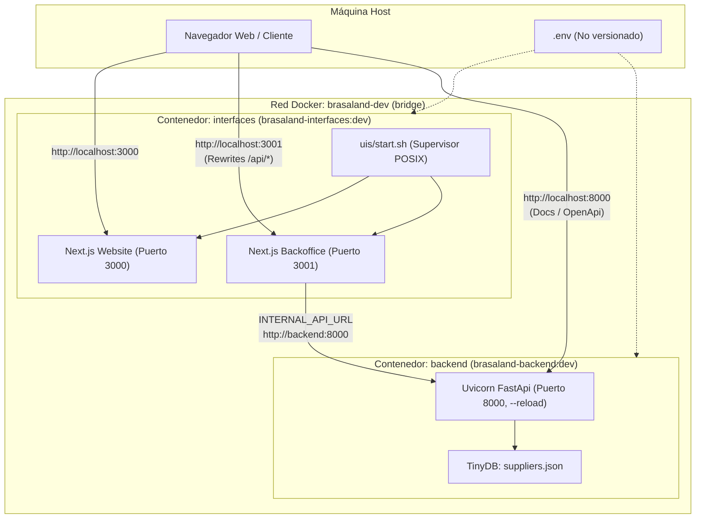

# Walkthrough: Hito de Infraestructura — Dockerizar el Entorno Completo de Desarrollo

Se ha completado la dockerización del entorno local de desarrollo para el monorepo Brasaland sobre la base de la PR #12 (`feature/backoffice-inventario`), permitiendo que un desarrollador ejecute `docker compose up --build` desde la raíz y obtenga Website, Backoffice y la API de FastAPI corriendo con hot reload, comunicación interna por red Docker y configuración desacoplada vía variables de entorno.

---

## 1. Arquitectura y Componentes Implementados



### 1.1 Servicios y Puertos Expuestos
- **`interfaces`** (`uis/Dockerfile`):
  - Imagen: `brasaland-interfaces:dev` (basada en `node:22-alpine`, usuario `node:node`).
  - Puerto `3000`: Website (`uis/website`).
  - Puerto `3001`: Backoffice (`uis/backoffice`).
  - Script supervisor `uis/start.sh`: levanta concurrentemente ambos servicios Next.js con soporte para dependencias externas monorepo (`--webpack`), captura señales `SIGTERM`/`SIGINT` y previene procesos huérfanos.
  - Volúmenes anónimos `/app/website/node_modules`, `/app/website/.next`, `/app/backoffice/node_modules`, `/app/backoffice/.next` para aislar dependencias del contenedor de las del host.
- **`backend`** (`services/Dockerfile`):
  - Imagen: `brasaland-backend:dev` (basada en `python:3.12-slim`, usuario `appuser:appuser`).
  - Puerto `8000`: FastAPI Backend (`services/api`).
  - Gestor de dependencias: `uv` oficial. Virtualenv aislado en `/opt/venv` para que el bind mount `./services:/app` no sobrescriba ni contamine las librerías instaladas.
  - Healthcheck HTTP integrado: `curl -f http://localhost:8000/health || exit 1`.
  - Preservación íntegra de TinyDB: `SUPPLIERS_DB_PATH=/app/api/data/suppliers.json`.
- **Red Docker**:
  - `brasaland-dev` (bridge), permitiendo resolución interna de nombres de servicio (`http://backend:8000`).

---

## 2. Configuración y Proxies

### 2.1 Proxy Rewrite en Backoffice (`uis/backoffice/next.config.ts`)
Se actualizó la configuración de Next.js para admitir la variable `INTERNAL_API_URL`, permitiendo que el navegador llame a `/api/*` en el mismo origen (`localhost:3001`) y el servidor Next.js lo reenvíe de forma segura hacia el backend dentro de la red Docker (`http://backend:8000`):

```typescript
const internalApiUrl = (process.env.INTERNAL_API_URL || 'http://127.0.0.1:8000').replace(/\/+$/, '');

const nextConfig: NextConfig = {
  transpilePackages: ['../../src'],
  experimental: {
    externalDir: true,
  },
  async rewrites() {
    return [
      {
        source: '/api/:path*',
        destination: `${internalApiUrl}/:path*`,
      },
    ];
  },
};
```

### 2.2 Variables de Entorno (`.env.example`)
Se preservaron intactas todas las variables de PostgreSQL, MongoDB, pgAdmin y backend existentes, agregando únicamente las requeridas para Docker:
- `DATABASE_URL`: Cadena de conexión a PostgreSQL accesible desde la red Docker.
- `SUPPLIERS_DB_PATH`: Ruta al archivo TinyDB en el contenedor (`/app/api/data/suppliers.json`).
- `INTERNAL_API_URL`: URL interna del backend (`http://backend:8000`).

---

## 3. Evidencias de Validación

### 3.1 Construcción de Imágenes Docker
```bash
docker build -f uis/Dockerfile -t brasaland-interfaces:dev uis
docker build -f services/Dockerfile -t brasaland-backend:dev services
```
- Contexto de `uis`: Reducido a <10 KB mediante exclusiones recursivas en `uis/.dockerignore` (`**/node_modules`, `**/.next`).
- Contexto de `services`: Excluidos `.venv`, `__pycache__` y archivos temporales en `services/.dockerignore`.

### 3.2 Verificación de Estado de Contenedores (`docker compose ps`)
```text
NAME                     IMAGE                      COMMAND                  SERVICE      CREATED          STATUS                    PORTS
brasaland-backend-1      brasaland-backend:dev      "uvicorn app.main:ap…"   backend      18 seconds ago   Up 18 seconds (healthy)   0.0.0.0:8000->8000/tcp, :::8000->8000/tcp
brasaland-interfaces-1   brasaland-interfaces:dev   "/app/start.sh"          interfaces   18 seconds ago   Up 17 seconds             0.0.0.0:3000-3001->3000-3001/tcp, :::3000-3001->3000-3001/tcp
```

### 3.3 Verificación de Endpoints y Puertos
- **FastAPI Health**: `curl http://localhost:8000/health` $\to$ `{"status":"ok"}` (HTTP 200)
- **FastAPI OpenAPI Docs**: `curl -I http://localhost:8000/docs` $\to$ HTTP 200 OK
- **Website**: `curl -I http://localhost:3000` $\to$ HTTP 200 OK
- **Backoffice**: `curl -I http://localhost:3001` $\to$ HTTP 200 OK
- **Backoffice Login**: `curl -I http://localhost:3001/login` $\to$ HTTP 200 OK
- **Backoffice Inventory**: `curl -I http://localhost:3001/backoffice/inventory/products` $\to$ HTTP 200 OK

### 3.4 Verificación de Comunicación Inter-Contenedor
Petición ejecutada desde dentro del contenedor `interfaces` hacia el nombre de red `http://backend:8000`:
```bash
docker compose exec -T interfaces wget -qO- http://backend:8000/health
```
**Resultado**: `{"status":"ok"}`

Petición a través del proxy rewrite de Next.js en Backoffice:
```bash
curl http://localhost:3001/api/health
```
**Resultado**: `{"status":"ok"}`

### 3.5 Verificación de Hot Reload
1. **Website (`uis/website/src/app/page.tsx`)**:
   - Se inyectó comentario temporal controlado.
   - Logs del contenedor registraron recompilación inmediata:
     ```text
     ✓ Compiled / in 409ms (webpack)
     ```
   - Revertido inmediatamente con confirmación de working tree limpio.
2. **Backoffice (`uis/backoffice/src/app/page.tsx`)**:
   - Se inyectó comentario temporal controlado.
   - Logs del contenedor registraron recompilación inmediata:
     ```text
     ✓ Compiled / in 654ms (webpack)
     ```
   - Revertido inmediatamente con confirmación de working tree limpio.
3. **Backend (`services/api/app/main.py`)**:
   - Se inyectó comentario temporal controlado.
   - Logs de Uvicorn registraron recarga automática:
     ```text
     WARNING:  StatReload detected file change in 'app/main.py'. Reloading...
     INFO:     Shutting down
     INFO:     Finished server process
     INFO:     Started server process
     INFO:     Application startup complete.
     ```
   - Revertido inmediatamente con confirmación de working tree limpio.

### 3.6 Pruebas Automatizadas del Monorepo
- **Pruebas de UIs** (`npm run test:uis`):
  - **46 pruebas pasando al 100%** (42 en `uis/backoffice`, 4 en `uis/website`).
  - Incluye la nueva suite `src/test/next-config-rewrites.test.ts` (3 pruebas de URL resolution y trailing slashes).
- **Pruebas de Backend** (`TEST_DATABASE_URL=... uv run --directory services/api pytest`):
  - **65 pruebas pasando al 100%** (0 fallos, 0 omitidas).
- **Typecheck, Lint y Build**:
  - `uis/website`: 0 errores de TypeScript, 0 lints, 5/5 páginas prerenderizadas con éxito.
  - `uis/backoffice`: 0 errores de TypeScript, 0 lints, 10/10 páginas prerenderizadas con éxito.

---

## 4. Instrucciones de Uso y Flujo de Operación

### 4.1 Requisitos Previos
Configurar un archivo `.env` en la raíz del repositorio basándose en `.env.example`:
```bash
cp .env.example .env
```
Asegurar que `DATABASE_URL` apunte a una base de datos PostgreSQL accesible desde la red de Docker (por ejemplo, IP de red Docker o host).

### 4.2 Iniciar el Entorno
```bash
docker compose up --build
```
O en segundo plano:
```bash
docker compose up --build -d
```

### 4.3 Detener el Entorno de Forma Segura
Para proteger los volúmenes de datos y la persistencia de TinyDB, detener con:
```bash
docker compose down
```
> [!CAUTION]
> No utilizar `docker compose down -v` en operaciones cotidianas, ya que destruye los volúmenes asociados.

---

## 5. Riesgos, Decisiones y Estado de Seguridad
- **Sin Credenciales Versionadas**: Ninguna clave o contraseña sensible ha sido hardcodeada en Dockerfiles ni en `docker-compose.yml`.
- **Fallo Defensivo en Compose**: Si falta `DATABASE_URL` o `SECRET_KEY`, `docker compose up` se detiene inmediatamente con un mensaje de error claro indicando la variable faltante.
- **Aislamiento de Dependencias**: El virtualenv en `/opt/venv` para Python y los volúmenes anónimos en `/app/*/node_modules` garantizan que los bind mounts de desarrollo no colisionen con las dependencias compiladas de Linux en los contenedores.
- **Sin Operaciones Destructivas en Git**: No se han realizado commits, rebases, merges ni cherry-picks sin autorización.

